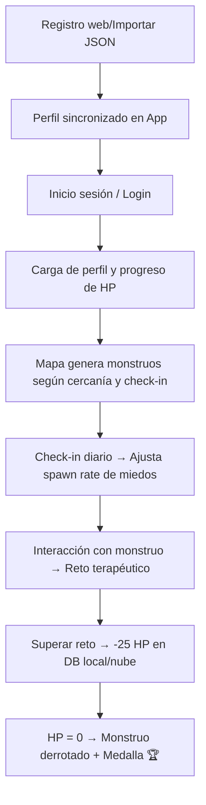

# 🛡️ Aurora GO

**Aurora GO** es una aplicación móvil Android que transforma el trabajo emocional en una experiencia interactiva y gamificada. Inspirada en juegos como Pokémon GO, Aurora GO te invita a salir a la calle, encontrar criaturas que representan tus miedos o emociones difíciles, y combatirlas mediante pequeños retos psicológicos.

> 🌱 **Complemento de bienestar emocional** – No sustituye la ayuda profesional.

---

## 📖 Descripción

Cada usuario crea un perfil en una **página web** donde selecciona sus emociones predominantes (por ejemplo, ansiedad social, frustración, tristeza o miedo al fracaso), asigna una intensidad (1‑5) y escribe un contexto opcional. Luego, al iniciar sesión en la app, esas emociones se convierten en **monstruos animados** que aparecen en un mapa real alrededor de la ubicación del usuario.

Al acercarte a uno de ellos (≤ 50 m), puedes **enfrentarlo** a través de un reto específico:

- **Sombra del Juicio** (ansiedad social): elegir la respuesta más positiva en un test.
- **Nube de Tormenta** (frustración/ira): realizar una respiración guiada.
- **Niebla Gris** (tristeza): tomar una foto de algo que te dé gratitud.
- **Reloj Tembloroso** (miedo al fracaso): escribir un logro reciente.

Cada reto superado resta 25 HP al monstruo; al llegar a 0 HP, el miedo se considera **derrotado** y se gana una medalla. Además, la app cuenta con un **check‑in diario** donde el usuario reporta la intensidad de sus emociones, lo que influye directamente en la frecuencia de aparición de cada tipo de monstruo.

---

## 🎯 Características principales

- **Registro y autenticación** con email/contraseña a través de Supabase.
- **Perfil personalizado** con lista de miedos y progreso persistente (HP restante por cada tipo).
- **Importación de perfiles** desde JSON legacy para facilitar la migración de datos de usuarios antiguos.
- **Mapa interactivo** basado en **Mapsforge** (offline, ligero, sin dependencias de Google Play).
- **Monstruos animados** con sprites dinámicos que reflejan el estado emocional del usuario.
- **Sistema de Spawn Inteligente**: La cantidad de monstruos de un tipo específico se ajusta según la intensidad reportada en el check-in diario.
- **Actualización en segundo plano** usando **WorkManager** para mantener la ubicación sincronizada y regenerar monstruos periódicamente.
- **Persistencia híbrida**: Supabase para la nube y archivos JSON locales para acceso rápido offline.
- **Interfaz moderna** con **Jetpack Compose** y **Material 3**.

---

## 🧰 Tecnologías utilizadas

- **Lenguaje**: Kotlin
- **UI**: Jetpack Compose + Material 3
- **Mapas**: Mapsforge (VTM) para renderizado de tiles y capas de marcadores.
- **Backend**: Supabase (Auth, PostgREST, RLS)
- **Cliente Supabase**: `supabase-kt` + Ktor para la comunicación asíncrona.
- **Localización**: FusedLocationProviderClient (Google Play Services).
- **Trabajo en segundo plano**: Android WorkManager.
- **Serialización**: kotlinx.serialization (Supabase) + Gson (Local JSON).
- **Cámara**: CameraX para el reto de gratitud visual.

---

## 🗂️ Estructura del proyecto (resumen)

```
app/
├── src/main/java/com/efrix/aurorago/
│   ├── data/                # Modelos, Repositorios (Auth, Perfil) y Cliente Supabase
│   ├── ui/                  # Pantallas (Login, Mapa, Checkin, Importar Perfil)
│   ├── util/                # Helpers (Sprites, LocationWorker, Initializers)
│   ├── MainActivity.kt      # Orquestador de navegación
│   └── theme/               # Sistema de diseño Material 3
├── res/                     # Recursos visuales (Sprites, Iconos, Drawables)
└── build.gradle.kts         # Gestión de dependencias y configuración de compilación
```

---

## ⚙️ Configuración y ejecución

### Prerrequisitos

- Android Studio Jellyfish (o superior)
- JDK 17
- Dispositivo o emulador con Android 7.0 (API 24)+
- Cuenta en Supabase configurada.

### Variables de entorno

El proyecto utiliza `BuildConfig` para gestionar las credenciales de Supabase de forma segura. Asegúrate de configurar las siguientes propiedades en tu archivo `local.properties` o como variables de entorno:

```properties
SUPABASE_URL=https://tu-proyecto.supabase.co
SUPABASE_ANON_KEY=tu-clave-anon-publica
```

*Nota: No es recomendable hardcodear estas claves directamente en el código fuente.*

---

## 🔄 Flujo de trabajo



---

## 📊 Estado actual

El proyecto se encuentra en una fase de **consolidación de arquitectura**. Se ha migrado gran parte de la lógica a repositorios centralizados y se ha mejorado la estabilidad de la sincronización en segundo plano.

**Últimos avances**:
- **Centralización de configuración**: Uso de `BuildConfig` para desacoplar las credenciales de Supabase del código.
- **Importador de Perfiles**: Nueva pantalla para cargar datos legacy mediante JSON.
- **Lógica de Spawn Dinámica**: Implementación de un factor de multiplicación en el spawn de monstruos basado en el bienestar emocional diario.
- **Refactorización de Mapas**: Uso de `MapStateHolder` para una gestión de estado más limpia y evitar fugas de memoria.

---

## 🚀 Próximos pasos

- **Optimización de Sprites**: Implementar un sistema de renderizado de frames más eficiente para los monstruos en el mapa.
- **Sistema de Logros**: Añadir una galería de medallas persistente para motivar el progreso a largo plazo.
- **Mapas Offline**: Implementar la descarga de archivos `.map` para funcionamiento total sin conexión.
- **Notificaciones Push**: Recordatorios inteligentes para el check-in diario basados en la inactividad del usuario.
- **Feedback Visual**: Mejorar las animaciones de transición entre el mapa y los retos.

---

## 🤝 Contribuciones

Si deseas contribuir, puedes abrir un **issue** para discutir cambios o enviar un **pull request**.

---

## 📜 Licencia

Distribuido bajo la licencia **MIT**. Consulta el archivo `LICENSE` para más detalles.

---

*Última actualización: 22 de junio de 2026*
